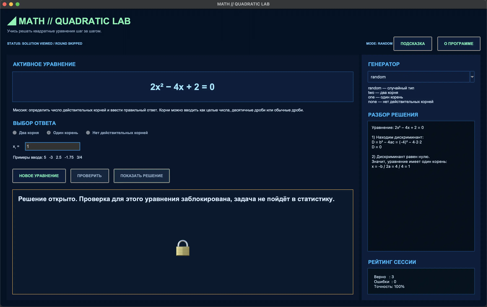
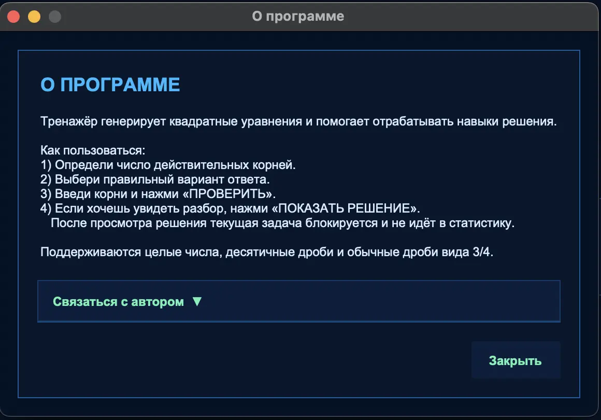
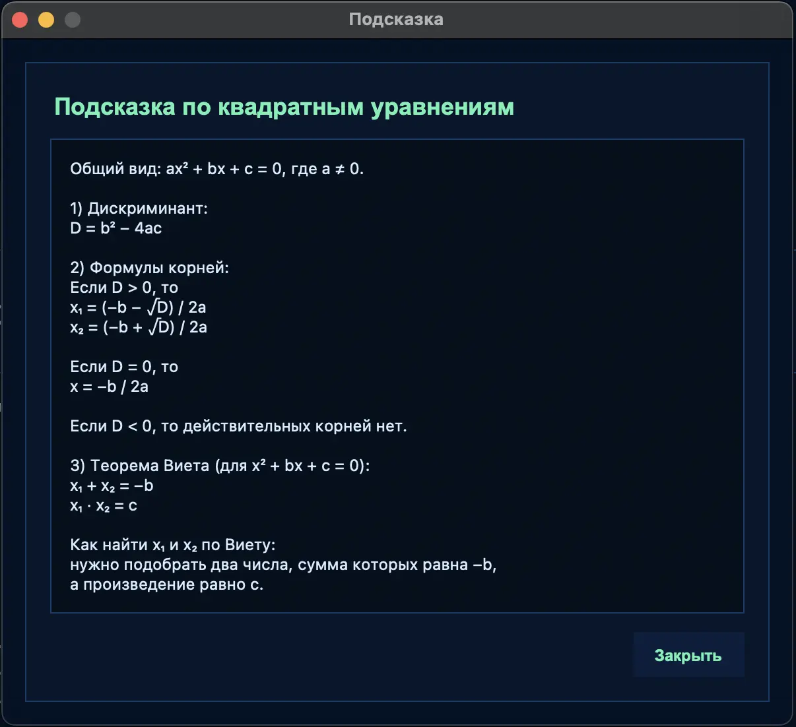

# ◢ MATH // QUADRATIC LAB

<p align="center">
  
  


  
  
</p>

<p align="center">
  <b>Учись решать квадратные уравнения шаг за шагом.</b>
</p>

Тренажёр по математике для школьников, который помогает решать квадратные уравнения, проверять ответы, разбирать ошибки и повторять основные формулы. Приложение написано на Python с использованием Tkinter и запускается как обычная настольная программа.

---

## ✨ Что умеет программа

- генерирует квадратные уравнения разных типов;
- позволяет выбрать режим генерации:
  - `random` — случайный тип;
  - `two` — два действительных корня;
  - `one` — один действительный корень;
  - `none` — действительных корней нет;
- проверяет ответы пользователя;
- поддерживает ввод корней как:
  - целых чисел;
  - десятичных дробей;
  - обычных дробей;
- показывает разбор решения через дискриминант;
- использует теорему Виета как дополнительную проверку там, где это возможно;
- ведёт статистику текущей сессии: верные ответы, ошибки и точность;
- содержит отдельные окна **«Подсказка»** и **«О программе»**.

---

## 🖼 Скриншоты

### Главное окно



### Окно «О программе»



### Окно «Подсказка»



---

## 🎯 Для чего нужна эта программа

Этот тренажёр подойдёт школьникам 7–11 классов, которые:

- только начинают знакомиться с квадратными уравнениями;
- хотят больше практики перед самостоятельной работой или контрольной;
- хотят научиться быстро определять число корней;
- хотят лучше понять дискриминант и теорему Виета;
- хотят тренироваться в удобном интерактивном формате.

Программа не просто говорит «правильно» или «неправильно», а помогает разобрать решение и понять, где именно возникла ошибка.

---

## 🚀 Запуск программы

### 1. Убедитесь, что установлен Python

Проверьте версию Python в терминале или командной строке:

```bash
python --version
```

или

```bash
python3 --version
```

Желательно использовать **Python 3.10+**.

### 2. Скачайте файл программы

В репозитории он называется:

```text
quadratic_trainer.py
```


---

## 💻 Запуск на Windows

### Способ 1 — двойной клик

Если Python установлен правильно и связан с `.py` файлами:

1. Откройте папку с программой.
2. Дважды щёлкните по файлу `.py`.

### Способ 2 — через командную строку

Откройте `cmd` или PowerShell и выполните:

```bash
python quadratic_trainer.py
```

Если команда `python` не сработала, попробуйте:

```bash
py quadratic_trainer.py
```

---

## 🍎 Запуск на macOS

Откройте **Terminal**, перейдите в папку с проектом:

```bash
cd /путь/к/папке/проекта
```

Запустите программу:

```bash
python3 quadratic_trainer.py
```

Если Tkinter не установлен в вашей сборке Python, установите Python с официального сайта или через удобный для вас менеджер пакетов.

---

## 🐧 Запуск на Linux

Откройте терминал и перейдите в папку проекта:

```bash
cd /путь/к/папке/проекта
```

Запустите:

```bash
python3 quadratic_trainer.py
```

Если Tkinter отсутствует, установите его через пакетный менеджер.

Например, для Ubuntu / Debian:

```bash
sudo apt update
sudo apt install python3-tk
```

---

## 🧠 Как пользоваться программой

### 1. Сгенерируйте уравнение
Нажмите кнопку **«НОВОЕ УРАВНЕНИЕ»**, чтобы получить новое квадратное уравнение.

### 2. Определите количество действительных корней
Выберите один из вариантов:

- **Два корня**
- **Один корень**
- **Нет действительных корней**

### 3. Введите ответ
Если корни есть — введите их в соответствующие поля.

Можно использовать такие форматы:

- `5`
- `-3`
- `2.5`
- `-1.75`
- `3/4`
- `-7/2`

### 4. Нажмите «ПРОВЕРИТЬ»
Программа проверит ответ и покажет результат.

### 5. При необходимости откройте разбор
Кнопка **«ПОКАЗАТЬ РЕШЕНИЕ»** выводит математический разбор: вычисление дискриминанта, нахождение корней и, при необходимости, проверку по теореме Виета.

---

## 📘 Что есть в окне «Подсказка»

В окне подсказки собраны основные опорные правила:

- формула дискриминанта `D = b² − 4ac`;
- случаи `D > 0`, `D = 0`, `D < 0`;
- теорема Виета;
- как находить `x₁` и `x₂`;
- краткие ориентиры для школьника при решении.

Это удобно, если нужно быстро вспомнить тему перед практикой.

---

## ℹ️ Что есть в окне «О программе»

В этом окне находится:

- краткое описание программы;
- базовая инструкция по использованию;
- блок связи с автором.

---

## 📊 Что показывается в статистике

Программа считает:

- количество верных ответов;
- количество ошибок;
- точность в процентах.

Это помогает отслеживать прогресс во время одной сессии тренировки.

---

## 🧩 Особенности проекта

- Интерфейс оформлен в неоновом стиле.
- Программа работает без сторонних библиотек.
- Используются только стандартные модули Python:
  - `tkinter`
  - `math`
  - `random`
  - `fractions`
- Подходит для учебных проектов, кружков, демонстраций и самостоятельной практики.

---

## 👨‍🏫 Для учителей и родителей

Программа может использоваться как:

- домашний тренажёр;
- интерактивное упражнение на уроке;
- демонстрационный мини-проект по Python и математике;
- простой способ закрепить тему квадратных уравнений без перегрузки интерфейсом.

---

## ❤️ Идея проекта

Проект сделан как понятный и красивый тренажёр для школьников, чтобы квадратные уравнения перестали казаться сложной темой и стали обычной практикой: шаг за шагом, с проверкой, подсказками и разбором решений.
